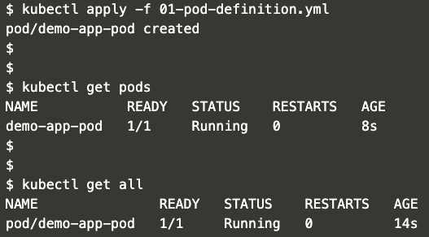

Pods:
---
- Definition
    ```yml
    apiVersion: v1
    kind: Pod

    metadata:
    name: demo-app-pod
    labels:
        app: demo-app
        type: front-end
        version: 1.0.0

    spec:
    containers:
        - name: demo-app-container
        image: avpatel257/k8s-docker-demo-web
        ports:
            - containerPort: 8080


    ```
- Apply
    ```
    kubectl apply -f 01-pod-definition.yml
    ```

- Verify
    ```
    kubectl get pods
    ```
    OR
    ```
    kubectl get all
    ```

- Expected output:
    - 


- Cleanup:
    ```
    kubectl delete -f 01-pod-definition.yml
    ```
