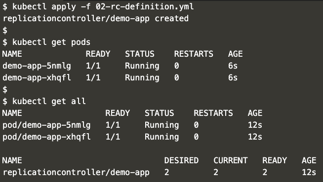

Replication Controller
---
- Definition
    ```yml
    apiVersion: v1
    kind: ReplicationController
    metadata:
    name: demo-app
    spec:
    replicas: 2
    selector:
        app: demo-app
        version: 1.0.0
    template:
        metadata:
        name: demo-app
        labels:
            app: demo-app
            type: front-end
            version: 1.0.0

        spec:
        containers:
            - name: demo-app-container
            image: avpatel257/k8s-docker-demo-web
            ports:
                - containerPort: 8080

    ```

- Apply
    ```
    kubectl apply -f 02-rc-definition.yml
    ```

- Verify
    ```
    kubectl get pods
    ```
    OR
    ```
    kubectl get all
    ```

- Expected output:
    - 


- Cleanup:
    ```
    kubectl delete -f 02-rc-definition.yml
    ```

