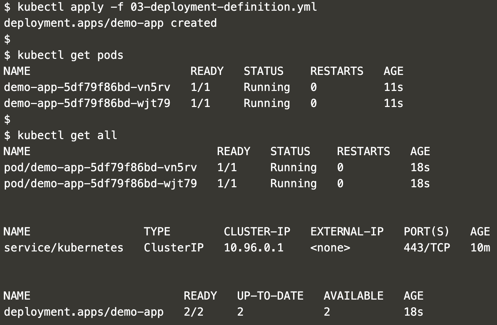
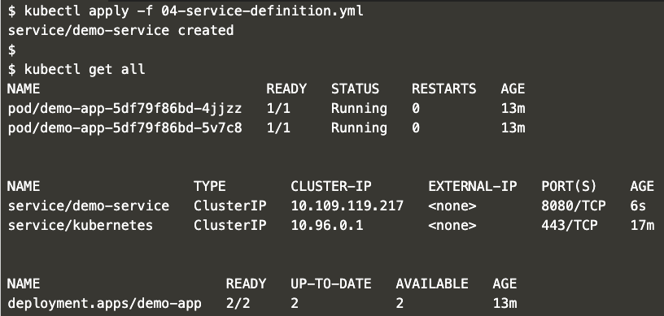

Installation Prerequisites
---
You can use `katacoda` to launch a single node kubernetes cluster.

[Launch Single Node Kubernetes Cluster](https://www.katacoda.com/courses/kubernetes/launch-single-node-cluster)

Once your cluster is ready you can continue following instructions below.

Table Of Contents:
* [Pods](#Pods)
* [Replication Controllers](#Replication-Controllers)
* [Deployments](#Deployments)
* [Service](#Service)
    * [NodePort Service](#NodePort-Service)
* [Rolling Updates](#Rolling-Updates)
* [Rollbacks](#Rollbacks)
* [Traffic Shift](#Traffic-Shift)


Pods
---
- Apply
    ```
    kubectl apply -f 01-pod-definition.yml
    ```

- Verify
    ```
    kubectl get pods
    ```
    OR
    ```
    kubectl get all
    ```

- Expected output:
    - 


- Cleanup:
    ```
    kubectl delete -f 01-pod-definition.yml
    ```
Replication Controllers
---
- Apply
    ```
    kubectl apply -f 02-rc-definition.yml
    ```

- Verify
    ```
    kubectl get pods
    ```
    OR
    ```
    kubectl get all
    ```

- Expected output:
    - 


- Cleanup:
    ```
    kubectl delete -f 02-rc-definition.yml
    ```

Deployments
---
- Apply
    ```
    kubectl apply -f 03-deployment-definition.yml
    ```

- Verify
    ```
    kubectl get pods
    ```
    OR
    ```
    kubectl get all
    ```

- Expected output:
    - 


- Cleanup:
    ```
    kubectl delete -f 03-deployment-definition.yml
    ```

Service
---
- Apply
    ```
    kubectl apply -f 04-service-definition.yml
    ```

- Verify
    ```
    kubectl get pods
    ```
    OR
    ```
    kubectl get all
    ```

- Expected output:
    - 


- Cleanup:
    ```
    kubectl delete -f 04-service-definition.yml

NodePort Service
---
- Apply
    ```
    kubectl apply -f 05-nodeport-service-definition.yml
    ```

- Verify
    ```
    kubectl get pods
    ```
    OR
    ```
    kubectl get all
    ```

- Expected output:
    - 


- Cleanup:
    ```
    kubectl delete -f 05-nodeport-service-definition.yml

Rolling Updates
---
- Apply
    ```
    kubectl apply -f 06-rolling-update.yml
    ```

- Verify
    ```
    kubectl get pods
    ```
    OR
    ```
    kubectl get all
    ```

- Expected output:
    - 


- Cleanup:
    ```
    kubectl delete -f 06-rolling-update.yml

Rollbacks
---
- Apply
    ```
    kubectl apply -f 07-rollback.yml
    ```

- Verify
    ```
    kubectl get pods
    ```
    OR
    ```
    kubectl get all
    ```

- Expected output:
    - 


- Cleanup:
    ```
    kubectl delete -f 07-rollback.yml

Traffic Shift
---
- Apply
    ```
    kubectl apply -f 08-traffic-shift.yml
    ```

- Verify
    ```
    kubectl get pods
    ```
    OR
    ```
    kubectl get all
    ```

- Expected output:
    - 


- Cleanup:
    ```
    kubectl delete -f 08-traffic-shift.yml