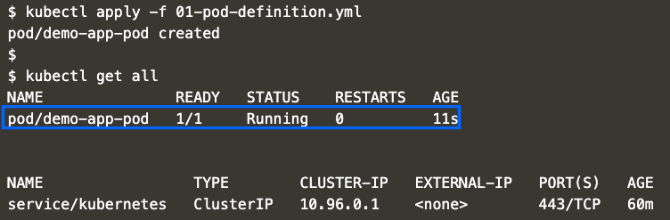
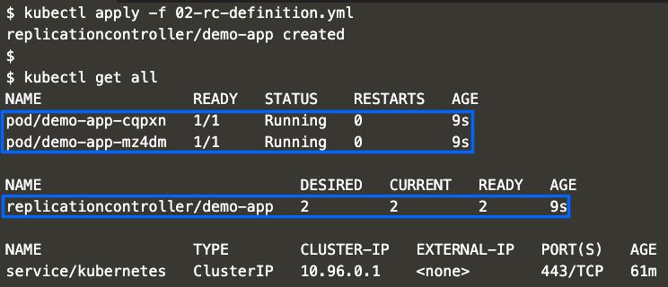
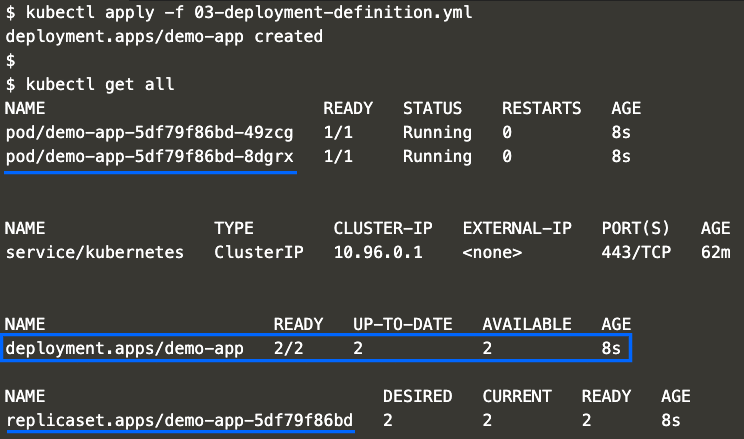
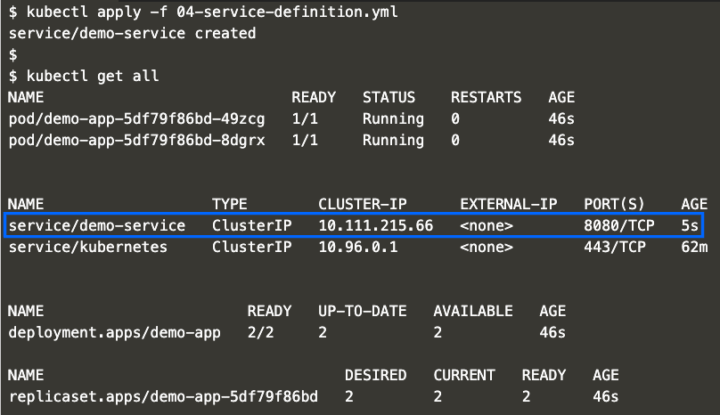
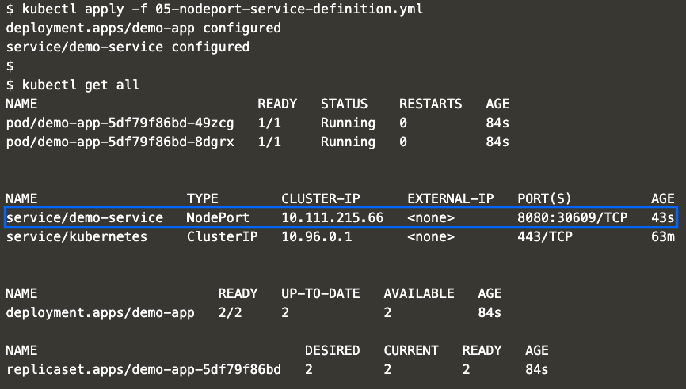
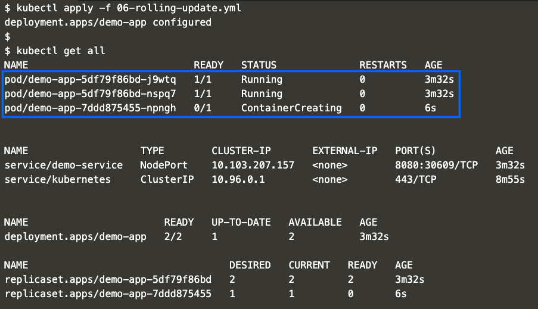
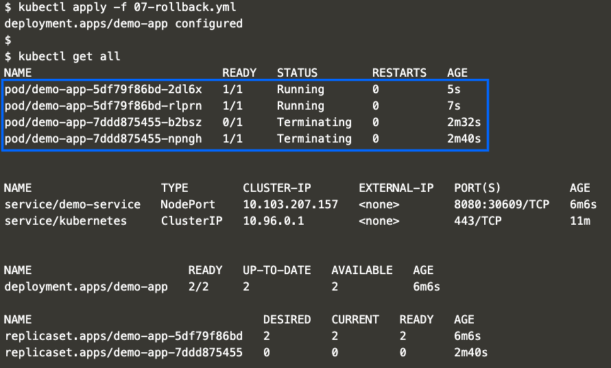
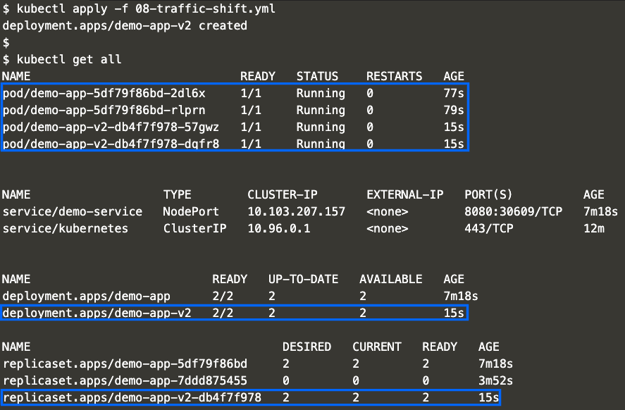

Installation Prerequisites
---
[Open katacoda](https://www.katacoda.com/courses/kubernetes/launch-single-node-cluster)

Perform following steps in `katakoda` terminal:


- Clone this repo
```
git clone https://github.com/avpatel257/k8s-docker-springboot-web.git

```

```
cd k8s-docker-springboot-web/k8s

chmod +x setup.sh

./setup.sh
```


Once your cluster is ready you can continue following instructions below.

Table Of Contents:
* [Pods](#Pods)
* [Replication Controllers](#Replication-Controllers)
* [Deployments](#Deployments)
* [Service](#Service)
    * [NodePort Service](#NodePort-Service)
* [Rolling Updates](#Rolling-Updates)
* [Rollbacks](#Rollbacks)
* [Traffic Shift](#Traffic-Shift)
* [Commands](#Commands)


Pods
---
- Apply
    ```
    kubectl apply -f 01-pod-definition.yml
    ```

- Verify
    ```
    kubectl get pods
    ```
    OR
    ```
    kubectl get all
    ```

- Expected output:
    - 


- Cleanup:
    ```
    kubectl delete -f 01-pod-definition.yml
    ```
Replication Controllers
---
- Apply
    ```
    kubectl apply -f 02-rc-definition.yml
    ```

- Verify
    ```
    kubectl get pods
    ```
    OR
    ```
    kubectl get all
    ```

- Expected output:
    - 


- Cleanup:
    ```
    kubectl delete -f 02-rc-definition.yml
    ```

Deployments
---
- Apply
    ```
    kubectl apply -f 03-deployment-definition.yml
    ```

- Verify
    ```
    kubectl get pods
    ```
    OR
    ```
    kubectl get all
    ```

- Expected output:
    - 


Service
---
- Apply
    ```
    kubectl apply -f 04-service-definition.yml
    ```

- Verify
    ```
    kubectl get pods
    ```
    OR
    ```
    kubectl get all
    ```

- Expected output:
    - 


NodePort Service
---
- Apply
    ```
    kubectl apply -f 05-nodeport-service-definition.yml
    ```

- Verify
    ```
    kubectl get pods
    ```
    OR
    ```
    kubectl get all
    ```

- Expected output:
    - 


Rolling Updates
---
- Apply
    ```
    kubectl apply -f 06-rolling-update.yml
    ```

- Verify
    ```
    kubectl get pods
    ```
    OR
    ```
    kubectl get all
    ```

- Expected output:
    - 


Rollbacks
---
- Apply
    ```
    kubectl apply -f 07-rollback.yml
    ```

- Verify
    ```
    kubectl get pods
    ```
    OR
    ```
    kubectl get all
    ```

- Expected output:
    - 


Traffic Shift
---
- Apply
    ```
    kubectl apply -f 08-traffic-shift.yml
    ```

- Verify
    ```
    kubectl get pods
    ```
    OR
    ```
    kubectl get all
    ```

- Expected output:
    - 

Commands
---
Get IP of the minikube node

```sh
export INGRESS_HOST=`minikube ip`
```

Hit the service endpoint
```sh
while true; do curl $INGRESS_HOST:30609/api/users/version; echo ""; sleep .5; done    
```
