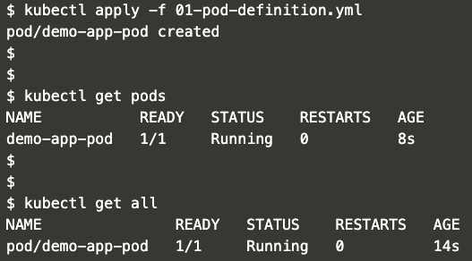

Pods:
---
- Apply
    ```
    kubectl apply -f 01-pod-definition.yml
    ```

- Verify
    ```
    kubectl get pods
    ```
    OR
    ```
    kubectl get all
    ```

- Expected output:
    - 


- Cleanup:
    ```
    kubectl delete -f 01-pod-definition.yml
    ```
